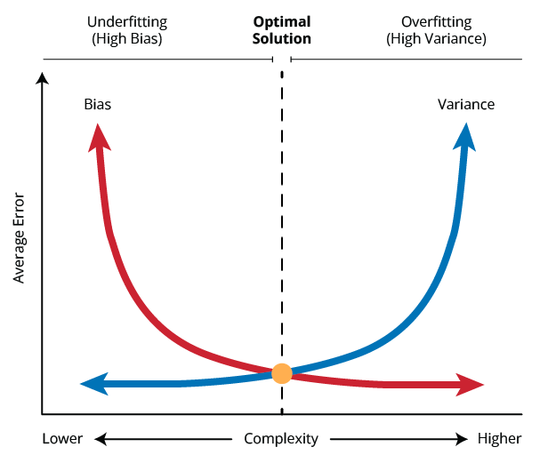

```{r setup, include=FALSE}
knitr::opts_chunk$set(echo = TRUE)
```

\newpage

# Module 1: Introduction to Machine Learning 

## 1.1 What is Machine Learning 

- ML is a branch of AI which assists humans by using data and algorithms and gradually improving 

**Artificial Intelligence**: exceeding or matching the capabilities of a human. Ability to discover (find new information), infer (read in other info from sources that not explicitly stated), and reason (figure things out) 

- natural language processing, vision, text to speech, motion

**Machine Learning**: something that learns rather than having to be programmed, uses large amounts of information to do this. A subset of AI. There are two main types: supervised (has more human involved learning) and unsupervised learning 

- medical treatments (NN used to read genes of viruses and detect potentially dangerous mutations), self-driving cars (locating landmarks on the fly to make prediction more accurate), banking automation (better offers for customers, fraud detection)

**Deep Learning**: a subset of ML and an example includes neural networks which have many different layers. Often don't know how reliable the results are or how they were derived. 

## 1.2 Type of Machine Learning 

### Supervised Learning 

Machines are trained on labelled data - contains observations with: 

- Input data, consisting of the properties of observations (e.g. shape, age, height, etc.) 

- Output data or the label of the observation (e.g. cat or dog, diabetes or non-diabetes) 

The properties of data are also called *features*. The label is also called the *outcome*. Supervised learning find a mapping from features to outcome. Applications include image classification, risk assessment, patient classification, fraud detection. 

**Pros**: 

- can predict output based on previous experiences 

- have exact idea about the classes of an object 

- widely used for solving real-world problems 

**Cons**: 

- not suitable for complex tasks 

- not able to predict with high accuracy if test data is different from training data 

- execution time of training could be very high 

- need sufficient knowledge about classes of data 

### Unsupervised Learning 

Do not have labelled data and so we cannot supervise the ML models with the relationship between data features and target variable. Finds hidden patterns and groups data based on this. 

**Pros**: 

- can be used for more complex tasks due to not requiring labelled data 

- easier to use due to no labelled data 

**Cons**: 

- more difficult than supervised as there are no state feature or target variable 

- may have less accuracy as algorithms don't know exact output 

### Reinforcement Learning (RL) 

A type of algorithm based on an agent learning to behave properly in an environment in which it is rewarded for good outcomes and punished for bad ones. So, it is mainly a feedback based ML technique, learns by it's own experiences. There is no labelled data. Useful when decision making is sequential and goal is achieved in the long-term (such as ChatGPT). 

## Machine Learning Workflow 

The success of an ML project relies on designing a valid research questions and then following these steps: 

1. **Gather data**: using real0time data from internet-of-things (IoT) -based devices or collecting it from other valid databases. 

2. **Prepare data**: one of the most important requirements for a successful ML project. Common to spend a lot of time on this step. 

3. **Select the model**: that best fits data at hand - identifying proper supervised, unsupervised, or reinforcement learning model 

4. **Train and Test**: choose proper ratio of data for training ML models and testing their performance 

5. **Evaluate**: select best parameters for the model to achieve highest accuracy 

## 1.3 Python and Virtual Environment Installation 

Python was introduced in 1991 and is often called a scripting language as you can write quick codes (scripts) to automate tasks. Very popular for data analysis and visualization, interactive computing, and machine learning. 

### Python Packages or Libraries 

Python doesn't include everything you need right away. Can install developer written software for specific purposes. 

**Library**: a collection of pre-written code that provides specific functions or capabilities 

**Package**: way to organize related modules to create a modular and structured codebase 

### Virtual Environment 

Can use a browser to run python and runs code snippets in the backend. Keeps a copy of current Python and package versions on the disk so that code runs properly. 

\newpage 

# Module 2: Python Language Basics 

## 2.1 Basic Semantics 

Some core semantics of Python include: 

*Object Model*: everything (numbers, strings, data structures, functions, etc.) are considered as an object 

*Comments*: text preceeded with a # are ignored by the interpreter 

*Functions*: call functions using parentheses using zero or more arguments. Almost all object have functions and call them by `object.method(x, y, z)`. 

*Variables and argument passing*: when assigning a variable, we create a reference to the object on the right side of the equality 


```
# Assign x to a new variable
x = [1,2,3]
# y and x refer to the same object
y = x
y
``` 

*Dynamic References*: object references have no inherent types. Types are important to know how to handle variables and so can see type of object using `type(variable)`. 

*Attributes and methods*: objects have attributes (other object stored inside this one) and methods (functions related to an object to access internal data). 

### Imports 

Need to first import modules, libraries, or the packages to use methods or functions within them. If we have the following file: 

```
PI = 3.14159

def f(x):
    return x+5

def g(a,b):
    return a*b
``` 

Now, from another file, we want to create two variables based on the scalar and functions in "some_module.py" so we can import it. 

```
import some_module 

result = some_module.f(10)
pi = some_module.PI
``` 

Can also import specific parts from some_module. 

```
from some_module import g, PI

result = g(10, PI)
``` 

You can also give an import a short form using the `as` keyword. 

```
import some_module as sm
from some_module import PI as pi

a1 = sm.f(pi)
a2 = sm.g(10,pi)
```

## 2.2 Types of Objects 

*Python Objects*: scalar types (numbers, strings, booleans) and sequence types (lists, tuples, sets, dictionaries) 

*Numpy Objects*: arrays 

*Pandas Objects*: series, dataframes 

### Python Objects 

**Scalar Types** 

Are built-in types used to deal with numerical data, strings, or boolean values. Below is a list of main scalars: 

- `None`: null or missing value 

- `str`: string or text 

- `int`: integer (whole number) 

- `float`: floating-point number (decimal points) 

- `bytes`: raw binary data 

- `bool`: Boolean (`True` or `False`) value 

Numbers: can be in different forms, mainly `int` and `float`. Integers take less memory so use them unless otherwise necessary. 

Strings: are words or Unicode characters. Need to put them in single (') or double (") quotes to distinguish from variables. Put them in triple quotes (''' or """) for multiline strings with line breaks. 

- string are immutable but can be combined using `+` 

You can specify the types of your variables by using the appropriate constructors such as, `str()`, `float()`, `int()`. 

**Lists and Tuples** 

A *list* stores a sequence of values in a single variable, which can include any data types and duplicates. Use square brackets. Can also use `list()` constructor. 

- lists are mutable

```
l = [1, 2, 3]
# Note the double parentheses
l2 = list(("machine", 4, False))
``` 

A *tuple* is similar to a list but defined with round braces or none at all. 

- requires very small amount of memory since it is immutable 

```
t = (1, 2, 3)
t = 1, 2, 3
t = tuple((1, 2, 3))
``` 

A *set* also stores multiple elements of any data types in a single variable and uses curly braces. 

- unordered and does not allow duplicates 

```
s = {1, 2, 3}
``` 

A *dictionary* (or *dict*) store data in the form of key-value pairs within curly braces. Can think of `keys` as columns and retrieve values of a certain key by `dictName[key]`. 

```
animals = {'fish': ['bass','cod','shark'],
          'amphibian': ['frog','salamander'],
          'insect': ['fly','spider'],
          'reptile': ['snake','crocodile'],
          'bird': ['eagle','jay'],
          'mammal': ['dolphin','dog']}
``` 

```
animals.keys()
# dict_keys(['fish', 'amphibian', 'insect', 'reptile', 'bird', 'mammal'])

animals.values()
# dict_values([['bass', 'cod', 'shark'], ['frog', 'salamander'], ['fly', 
'spider'], ['snake', 'crocodile'], ['eagle', 'jay'], ['dolphin', 'dog']]) 

animals.items()
# dict_items([('fish', ['bass', 'cod', 'shark']), ('amphibian', ['frog', 
'salamander']), ('insect', ['fly', 'spider']), ('reptile', ['snake', 
'crocodile']), ('bird', ['eagle', 'jay']), ('mammal', ['dolphin', 'dog'])])
``` 

### Numpy Objects 

Used for handling large scale mathematical operations, such as vector calculus, matrix algebra, etc. Used by scikit-learn and pandas packages in the backend. 

A Numpy *array* is a list of numbers and allows for more complex mathematical operations. 

```
y = np.array([1, 2, 3])
y**2 

array([1, 4, 9])
``` 

```
# Generate same psuedo-random numbers
np.random.seed(156) 
# Generate random integers between -4 and 4
arr = np.random.randint(-4,4,(5,5))
arr

# array([[ 0,  0, -2,  1,  3],
        [-1, -2, -3,  0,  3],
        [-2,  3,  1,  3, -2],
        [-4,  2, -1, -3,  2],
        [ 2, -4,  1,  3,  0]])
``` 

**Slice an Array** 

Inherits the same slicing method from a regular Python list, however, slices are applied separately as `[rows, cols]`. 

- Slice from beginning (omitted) to row 3 (not included) 

- Slice from second last column (-2) to the end (omitted) 

```
arr[:3,-2:]

# array([[ 1, 3],
        [ 0, 3],
        [ 3, -2]])
``` 

**Concatenate Arrays** 

There are many ways to combine to array, `a` and `b`, in Numpy. Two way include `vstack()` and `hstack()`. 

```
np.vstack([a, b])
np.hstack([a, b])
``` 

### Pandas Objects 

Pandas is a Swiss army knife for data preparation and analysis in machine learning. Two main data structures of pandas are `Series` and `DataFrame`. 

**Series** 

Similar to a list, can contain any data type or Python objects. 

```
s1 = pd.Series([5, 13, -9, 21])
s1 

# 0     5
  1    13
  2    -9
  3    21
  dtype: int64
``` 

We can customize the index to label our data: 

```
s2 = pd.Series([5,13,-9,21], index=['a','b','c','d'])
s2 

# a     5
  b    13
  c    -9
  d    21
  dtype: int64
``` 

Can index in several ways such as using the label or by using a Boolean expression: 

```
s2[['b', 'c']]

# b    13
  c    -9
  dtype: int64
  
s2[s2 > 8]

# b    13
  d    21
  dtype: int64
``` 

**DataFrame** 

A *data frame* is a collection of series and is represented in a tabular format consisting of rows and columns. Can also create a data frame from a dictionary using the `pandas.DataFrame` method. 

Can specify the order of the columns by passing the `columns` parameter: 

```
pd.DataFrame(data, columns=['year', 'province', 'population'])
``` 

Can extract a columns as a series by using the column name: 

```
df.province
# OR
df['province']
``` 

Can extract a row by passing a `loc` attribute: 

```
# Extract the third row
df.loc[3]
``` 

Can add a new column by an assignment statement. When adding a new column with fewer entries than the number of rows, can specify which rows the data is added to using the `index` parameter. The unspecified rows are assigned to `NaN`. 

```
df['debt'] = [314.1, 380.4, 185.0, 185.6, 37.7, 55.8] 

col = pd.Series([0.4, -1.9], index=[1, 3])
df['new'] = col
``` 

Can delete a column using the `del` keyword: 

```
del df['new']
``` 

Dates and time are very important in pandas. A column can be converted to a data using `pd.to_datetime()`. By default, the function expects ISO format (YYY-MM-DD) but you can change this with the `format` parameter. 

```
pd.to_datetime('30-09-2016', format='%d-%m-%Y')

# Timestamp('2016-09-30 00:00:00')
``` 

## 2.3 Common Data Manipulation 

A crucial step for the data processing pipeline for ML. It involves the process of cleaning, transforming, and preparing raw data to make sure its suitable for modeling. 

### String and List Methods 

`split()`: to separate a string by some indicators 

`strip()`: used to remove white space from a string 

`in`: to determine whether an element is part of a string or a list object 

`count()`: find the number of occurrences of a value 

`replace()`: used to replace a string with another value 

`str.upper()`: used to capitalize the first letter of a string. Can be applied on the column of a DataFrame 

`str.lower()`: used to lower case a string 

### The `Map()` Method 

Mapping is another way to add columns to a data frame. If we want to add a new column to the grade data, we can create a dictionary and use `map()` to manually match student names to grades. 

```
report_to_grade = {'Ariel': 75, 'Chris': 75, 'David': 85, 'Emily': 90, 'Isaac': 60,
                  'Jordan': 90, 'Morgan': 75, 'Olivia': 85, 'Ryan': 80, 'William': 95}
    
grade['report'] = grade['name'].map(report_to_grade)
``` 

### Replacing Values 

There are many ways to replace values and this is often done when there are `NaN` values for some data points. 

```
grade['quiz'].replace(0, np.nan)

# Replace multiple values with same value
grade['quiz'].replace([0, 100], np.nan)

# Replace multiple values with different values
grade['quiz'].replace([0, 100], [np.nan, 99])

# Can do the same with a dictionary
grade['quiz'].replace({0: np.nan, 100: 99})
``` 

### Rename Columns and Rows 

The `replace()` method can be used to change the name of the rows and columns. 

```
grade.rename(index=grade['name'], columns=str.title)
``` 

### Binning Methods 

Useful for when you need to sort continuous values into bins for further analysis. 

```
# Defining our own bins sizes with labels
bin_names = ['unacceptable', 'good', 'excellent']
bins = [0, 60, 80, 100]
group_n = pd.cut(report, bins, labels=bin_names)

# Equal sized cut with 2 decimal precision
pd.cut(report, 3, precision=2)

# Quantile-based cuts
pd.qcut(report, 3, precision=2)
```

Can count how many items are in each bin by using `pandas.value_counts` method and passing the cut data. 

### Random Sampling 

Random sampling is an efficient way to downsize a data set and is useful for bootstrapping. This is done using the `sample()` method. The axis can be specified using the `axis` parameter with `axis=1` corresponding to columns and the default set to rows. Replacement is specified through the `replace` parameter. 

```
grade.sample(num_samples, axis, replace)
```

\newpage

# Module 3: Data Preparation - Missing Values and Duplicates 

Data preparation is extremely important, a clean and prepared data set improves accuracy of models significantly. If not well-prepared, it is doomed to fail. 

## 3.1 Data Preparation Overview 

"Garbage in, garbage out". The output of our analysis grealy depends on the quality of the input. Most of the time, data does not come clean and so data preparation is a big part. 

A typical data prepartation process includes the following: 

1. Dealing with missing values 

2. Dealing with duplicates 

3. Dealing with categorical data 

4. Dealing with outliers 

5. Partitioning a data set 

6. Feature scaling 

7. Data visualization 

## 3.2 Missing Values 

Raw data often contains missing values or zeroes that are not observed, numeric values coded as strings, string coded as numbers, etc. ML models are usually not able to deal with these, but even if they can, it would be incorrect information and impact performance. 

Python presents missing (or null) values as `NaN`, which refers to data that does not exist or is not observed. 

### Find Missing Values 

We use pandas to work with missing data represented by: 

- `NaN` for numeric data 

- `None` for non-numeric arrays 

`DataFrame.isna()`: returns Boolean values - `True` for NA and `False` for all other values 

Most machine learning algorithms cannot handle missing values. There are two common approaches to dealing with them: 

1. **Deletion**: remove any observations with one or more null values 

2. **Imputation**: replace null values with other relevant values (e.g. column mean, median, etc.) 

### Delete Missing Values 

`DataFrame.dropna()`: used to remove all missing values (deletes row) 

`DataFrame.notna()`: print data without NA values but doesn't remove them 

- adding the `how='all'` parameter will only delete rows with all values being NA 

- adding the `axis=1` parameter will remove columns that contain NA - doesn't really make sense to do 

### Replace Missing Values 

`DataFrame.fillna()`: fill missing values with predefined values 

- can specify the replacing value for each column by passing a dictionary 

```
data_with_dict = data_with_na.fillna({'Col1':0.7, 'Col2':0.3, 'Col3':0.5})
``` 

`DataFrame.fillna()`: propagates non-NA values in column to replace NA values. For forward filling, the value before the NA will be used and vice versa for backfill. 

- a `limit` can be passed to determine how many time a value can be used to replace an NA 

- `method` param can be passed to determine whether `bfill` or `ffill` 

- useful for time-series data (e.g. stock prices) 

- by default, `fillna` returns a copy of the data frame. Specifying `inplace=True` is useful to save memory. 

```
data_with_na.fillna(method="bfill", limit = 2)
``` 

Can also use `fillna()` to replace with some kind of calculated value, like mean or median. 

```
data_with_na.fillna(data_with_na.mean())
data_with_na.fillna(data_with_na.median())
``` 

## 3.3 Duplicates 

There are many situations where duplicate rows may be observed in a data set. This can cause ML models to form bias, uses more memory, and greater processing overhead. 

### Find Duplicates 

`DataFrame.duplicated()`: returns a Boolean series to indicate whether a row is duplicated 

### Delete Duplicates 

`DataFrame.drop_duplicates()`: removes duplicate rows 

- if you want to remove duplicates based on the value of a particular feature, you can pass the column as a parameter 

```
DataFrame.drop_duplicates(['Column Name'])
``` 

- by default, it keeps the first instance and removes all after, `keep='last'` will keep the last instance 

### Count Duplicates 

Important to know the number of duplicate observations. If there are millions of data points with only two duplicates, then not really a big deal and can just leave them. 

Can append the `sum()` or `value_counts()` methods to `DataFrame.duplicated()` to count the number of `True` and `False` values. 

```
data_dup.duplicated().sum()
data_dup.duplicated().value_counts()
``` 

# Module 4: Categorical Data 

It is very commong to see categorical data in real-world data sets. 

## 4.1 Categorical Methods 

Categorical data (aka categorical feature or variables) descrive the whole family of observations. From a computation view, it is easier to work with numbers than strings. 

### Find Categorical Values 

To extract distinct values from a Series, you can use functions like `unique()` or `value_counts()` in pandas. 

`unique()`: shows all unique values present in a Series 

`value_counts()`: shows the number of repetitions of each unique value in a Series 

### Categorical Encoding 

To enhance storage and computation efficiency, use methods to represent repeated categorical values using integers. A **dimension table** is one of the best practices for this. For example, have three colours of red, green, and blue would be converted to 0, 1, and 2 - we call this *categorical encoding* or *categorical representation*. A categorical object has two useful attributes: 

- `categories` refers to all distinct values of the feature 

- `codes` refers to the integer values associated with their categories  

```
city = pd.Categorical(['Paris', 'Tokyo', 'Cairo', 'Cairo', 'Paris', 'Paris'], dtype='category')

city.categories
# Index(['Cairo', 'Paris', 'Tokyo'], dtype='object')

city.codes
# array([1, 2, 0, 0, 1, 1], dtype=int8)
``` 

Can also create a 1:1 mapping from categories to codes using a dictionary. 

```
dict(enumerate(city.categories))

# {0: 'Cairo', 1: 'Paris', 2: 'Tokyo'}
```

### Convert Type to Categorical 

In pandas (and other packages), categorical data is often identified as a generic object class if not specified - occupies more memory than it should. Can change these data type to categorical using the `astype()` method. 

```
client = pd.DataFrame({'Country':['France', 'Japan', 'Egypt', 'Egypt', 'Japan', 'France', 'Japan'], 
                       'Age':[27, 26, 28, 25, 27, 32, 33], 
                       'Weight':[202, 146, 180, 219, 121, 288, 167]})
                       
client.dtypes
# Country    object 
  Age         int64 
  Weight      int64 
  dtype: object
``` 

Change the data type of country column to categorical. 

```
country_cat = client['Country'].astype('category')
``` 

Can use the `.categories` and `.codes` accessors to categorical data by joining it with `.cat`. 

```
country.cat.categories
# Index(['Egypt', 'France', 'Japan'], dtype='object')

country.cat.codes
# 0    1 
  1    2 
  2    0 
  3    0 
  4    2 
  5    1 
  6    2 
  dtype: int8
``` 

### Remove Unused Categories 

When working with large data frames or series, we may not want to use all of the categories, and so we may want to remove some of them. You can use `.value_counts()` to see if you have any unused categories and then remove them using `.cat.remove_unused_categories()`. 

### Types of Categorical Data 

There are two sub-branches in categorical data: 

1. **Ordinal**: are ordered or ranked categories (levels of education, product ranking, employee satisfaction) 

2 .**Nominal**: are unordered categories (hair colours, ethnic groups, types of diseases) 

## 4.2 Ordinal Encoding 

Should map them to integers in order. There is no automatic way to do such mapping. Can create a dictionary mapping the ordinal variables to integers, and then use `replace()` or `map()` to replace the values. 

```
dict_map = {'high':3, 'medium':2, 'low':1}
market['Rank'] = market['Rank'].replace(dict_map) 
# or 
market['Rank'] = market['Rank'].map(dict_map) 
``` 

### Decoding 

To transform the encoded integers back to string categories, can use an inverse map. Then you can again use `replace()` or `map()` to replace the values. 

```
inv_dict_map = {v:k for k,v in dict_map.items()} 
market['Rank'] = market['Rank'].replace(inv_dict_map) 
``` 

## 4.3 Nominal Encoding 

Nominal categorical values can be converted to numeric ones using the following methods: 

- label encoding 

- one-hot encoding 

### Label Encoding 

The idea is to assign a distinct integer to each categorical label in the data. A simple way to do this is to enumerate through the unique labels and then use `replace()` or `map()` to replace the values. 

```
market['Country'].unique()
# array(['France', 'Japan', 'Egypt'], dtype=object)

label = {label:code for code,label in enumerate(np.unique(market['Country']))} 
# {'Egypt': 0, 'France': 1, 'Japan': 2}

market['Country'] = market['Country'].replace(label) 
``` 

### LabelEncoder 

One easier way to do this automatically is through LabelEncoder from `sklearn`. Import the package, create an instance of the encoder class, and then use `fit_transform()` to convert labels to integers. 

```
from sklearn.preprocessing import LabelEncoder

le = LabelEncoder() 
market['Country'] = le.fit_transform(market['Country'].values) 
``` 

### Decoding 

Can simply use `inverse_transform()` to get back string values from the integer values. 

```
market['Country'] = le.inverse_transform(market['Country']) 
``` 

### One-Hot Encoding 

Although label coding is convenient, it can create bias because it converts categories to integers with different sizes, implying that one is greater than another. One-hot encoding represents each country in binary format of length of unique categories. 

### Dummy Variables 

These binary variables are also called *dummy variables*. The pandas `get_dummies()` method is an easy way to transform nominal variables into numeric values, representing an **indicator matrix**. If the feature (column) has n distinct values, the matrix will have n columns. 

This will create a column for each country where each entry in the column indicates if the country is present in that row (1 or 0). 

```
pd.get_dummies(market2['Country'])

# Can add prefix to make it clear what feature its referring to
indicator = pd.get_dummies(market2['Country'], prefix='Country')  # will give Country_France for ex
``` 

If you want to merge another column to this data, can use the `join()` method. 

```
market2_matrix = indicator.join(market2[['Sales']])
``` 

### OneHotEncoder 

We can also use the one-hot encoder from `sklearn` to convert the data. 

```
from sklearn.preprocessing import OneHotEncoder
ohe = OneHotEncoder 
array = ohe.fit_transform(market[['Country']]) # has 3 countries 

# array([[0., 1., 0.],
        [0., 0., 1.],
        [1., 0., 0.], 
        [0., 0., 1.]])
``` 

Note that `OneHotEncoder` only accepts array-like integers or strings. So, when taking the column from a data frame as an input, we need to pass `sparse=False` to return an array. 

You can convert back to the original data as well. 

```
ohe.inverse_transform(array)
``` 

# Module 5: Outliers, Partitioning, and Feature Scaling 

## 5.1 Outliers 

It is important to check outliers because in some data sets, observations lie beyond our desired intervals. These values look different than the overall pattern of the data. 

### Finding Outliers 

Finding outliers is done through statistical analysis. This can be done by using the `DataFrame.describe()` method to view information like the standard deviation, max, min, mean, etc. You can view which rows meet some condition, like whether an observation is larger than a certain value. 

```
## Checking which rows in col 0 > 3
outlier = sample[0]  
outlier[outlier.abs()>3] 

## Checking which rows in any col are > 3
sample[(sample.abs()>3).any(axis="columns")]
``` 

### Three Standard Deviations 

In the case our data is fairly normal, we often define an outlier as further than three standard deviations ($\sigma$) away from the mean ($\mu$). 

$$\mu \pm 3\sigma$$ 

```
x = wine['Ash'] 
mean = x.mean() 
sd = x.std()  

outliers = (x < mean-3*sd) | (x > mean+3*sd)  
wine[outliers]
``` 

### Cap Outliers 

One way to deal with outliers is to replace them with threshold values. This is known as **capping** the outliers and in this case, replace the values with either $\mu + 3\sigma$ or $\mu - 3\sigma$. 

```
wine_ash = wine[outliers] 
 
outliers_below = (x < mean-3*sd) 
outliers_above = (x > mean+3*sd)  

wine['Ash'][outliers_below] = mean-3*sd 
wine['Ash'][outliers_above] = mean+3*sd
``` 

## 5.2 Partitioning 

In ML, the model is trained using the **training set** and and **test set** is used to obtain its accuracy. Some models also have additional parameters that need to be tuned, for these, we need another set called the **validation set**. 

### Underfitting and Overfitting 

When splitting data into train and test sets, we might remove some important info that could help train our model. So we don't want to assign too much to the test set. Also don't want to give too much to the train test because then model will be too specific and won't be good with new data. 

*Underfitting*: happens when the model can't capture the relationship between input features and target outputs or underlying pattern in data. Has high bias. Occurs when model is too simple and not given enough data for training. 

*Overfitting*: happens when model does a good job in training but performs poorly on test set. Are quite sensitive to small fluctuations in training set, so they have high variance. Occurs when model is too complex, has too many features to deal with. 

### Bias-Variance Tradeoff 

**Bias** is an indication of model error - difference between forecasted and true values. **Variance** refers to the flexibility of the model and its efforts to precisely capture the location of each data point during training. 

- practically not possible to have a model with low bias and variance - there is always a tradeoff 

- want to find a sweet spot between overly simple model and overly complex model 

  + if in underfitting zone (high bias), increase complexity to reduce bias 
  
  + if in overfitting zone (high variance), simplify to reduce variance 
  
 

### Train-Test Split 

- most common to use train-test ratio of 80:20 

- The smaller the data set, the more balanced the train-test split is - 70:30 or even 60:40 

- for a large data set (e.g. more than 100,000 points), its common to see 90:10 or even 99:1, as 10,000 points of data could still give good information about accuracy of model 

- if you need a validation set, a split could be 80:10:10 

### Split the Data 

We use `train_test_split` function from scikit-learn model selection package to randomly split a data set into two subsets. 

`train_test_split(*arrays, test_size=None, train_size=None, random_state=None, shuffle=True, stratify=None)` 

- the only required params are the **arrays** to be passed in. Generally, we have two arrays of data: one containing features (X) and one containing the target output (Y) 

- `test_size` and `train_size` can either be a ratio (float) or a number (int). We usually set a value between $0.0$ and $1.0$. If both are `None`, the default is $0.25$ for test size. 

- `random_state` accepts an integer to control randomization during splitting, so we won't have different types of data points for our subsets if we run multiple times (like a seed) 

- `shuffle`, by default, shuffles the data set before splitting 

- `stratify` determines if we want to split the data in a stratified manner 

```
from sklearn.model_selection import train_test_split

# Split whole data set, don't have separate cols for inputs and outputs
train, test = train_test_split(df, test_size=.2)  

# Can split of variables
X_train, X_test, y_train, y_test = train_test_split(df.iloc[:,1:], df.iloc[:,0], test_size=.2)
``` 

## 5.3 Feature Scaling 

Some ML methods have assumptions that must be satisfied for reliable inferences. The method may work well with small outputs, but its errors may inflate with large ones, making it hard to estimate model parameters. 

Before feeding data into our training models, we have to make sure inputs are within the same scale. Two common feature scaling methods are normalization and standardization, and are both implemented using scikit-learn. 

### Normalization 

Rescales input variables to a given range (such as [0,1] or [-1,1]), by keeping the distance between each data rational to the original distance. The minimum value in the data becomes the lower bound and the largest the upper, so we call it **min-max normalization**. 

$$x_i^{norm} = \frac{x_i - x_{min}}{x_{max} - x_{min}}$$ 

- min-max normalization is very sensitive to outliers, works well if variance is small and distribution is normal 

Can use `MinMaxScaler()` function from scikit-learn. Also, `MinMaxScaler` defaults to interval [0, 1] so to get between [-1, 1], need to initialize `MinMaxScaler((-1,1))`. 

```
from sklearn.preprocessing import MinMaxScaler

min_max = MinMaxScaler()  

wine_scaled = min_max.fit_transform(wine) 

# Split the data into input (X) and output (y)
X, y = wine.iloc[:,1:], wine.iloc[:,0] 

# Fit and transform the input columns 
X_scaled = min_max.fit_transform(X)
``` 

### Standardization 

Transform the feature values to have a mean of 0 and a variance of 1, so the column has the same parameters as a normal distribution. 

$$x_i^{std} = \frac{x_i - \mu_x}{\sigma_x}$$ 

- note that it doesn't change the shape from non-normal to normal 

- it is less sensitive to outliers, which maintain their information. 

We can use the `StandardScaler()` function from scikit-learn to standardize data. 

```
from sklearn.preprocessing import StandardScaler  

scaler = StandardScaler()

X, y = wine.iloc[:,1:], wine.iloc[:,0] 

X_scaled = scaler.fit_transform(X)  
```

# Module 6: Plotting and Visualization 

One of the most important parts of ML, can be used in all stages of the project. Can convey much more information than numbers can and give insight into patterns and gaps in data. 

## Plotting with Pandas 

The `plot` method can be used on Series and DataFrames. When `x` and `y` values are not specified, the row index is used for the x-axis and the values are mapped to the y-axis. 

There are many different kinds of plots that can be accessed using the `kind` parameter: 

- line plot (default) 

- vertical bar plot (bar) 

- horizonal bar plot (barh) 

- histogram (hist) 

- box plot (box) 

- kernel density estimation plot (kde / density) 

- area plot (area) 

- pie plot (pie) 

- scatter plot (scatter) 

You can also access each other of these kinds of plot as a method on `plot` in the case that you want to add more customization parameters. 

## 6.2 Plotting with Matplotlib 

Has a lot more customization than pandas and can support things like 3D plots. To use this package: 

```
import matplotlib.pyplot as plt

%matplotlib inline
``` 

## 6.3 Plotting with Seaborn 

# Module 8: Linear Regression 

## 8.1 Simple Linear Regression Model 

Linear regression is one of the simplest approaches to supervised learning to predict target values. 

Simple linear regression is a very straightforward method that can be used to make regression-based inference. The idea is to fit a linear line to show the *approximate* relationship that exists between two variables: 

- **X**: input or single *predictor variable* (aka independent variable) 

- **Y**: output or *target variable* (aka dependent variable) 

The relationship between X and Y, which can also be vectors, is: 

$$Y \approx \beta_0 + \beta_1 X$$ 

Or, to write this equation with an equals sign, you can add an error epsilon: 

$$Y = \beta_0 + \beta_1 X + \epsilon$$ 


